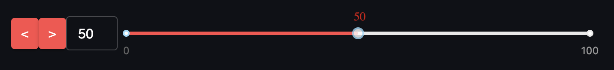

# streamlit-super-slider


# Streamlit Super Slider

Streamlit Super Slider is a custom component for Streamlit that extends the functionality of the default slider. It provides a more interactive and user-friendly experience with additional features to enhance usability.

## Features

1. Updates Streamlit only on mouse release, not during dragging the mouse.
2. Includes an input text box attached to the slider where changing the value in either updates the value in the other (input text changes the slider and vice versa).
3. Arrow buttons to increase/decrease the value by one, providing a "next" or "previous" button functionality.
4. Built-in keyboard shortcuts for quick navigation: "," (comma) for previous and "." (period) for next.

## Installation

You can install the package via pip:

```pip install streamlit-super-slider```


## Usage

To use the Streamlit Super Slider in your Streamlit app, you simply need to import it and use the `st_slider` function. The function signature is:

```python
st_slider(min_value, max_value, default_value=0, key=None)
```


## Usage

To use the Streamlit Super Slider in your Streamlit app, you simply need to import it and use the `st_slider` function. The function signature is:

```python
st_slider(min_value, max_value, default_value=0, key=None)
```

```python
import streamlit as st
from streamlit_super_slider import st_slider

st.title("Streamlit Super Slider Example")

min_value = 0
max_value = 100
default_value = 50

# Use the Streamlit Super Slider component
slider_value = st_slider(min_value, max_value, default_value)

st.write(f"Selected value: {slider_value}")
```

## Demo
In the following demo you can see usage of the slider to show images, and all the different ways to chose where to go:
* keybaord shortcut
* Pressing the arrows buttons
* Changing the value in the input text box
* Dragging the slider


## Contributing

We welcome contributions to the Streamlit Super Slider project. If you'd like to report bugs, request features, or contribute to the code, please [open an issue](https://github.com/fgdvir/streamlit-super-slider/issues) or [submit a pull request](https://github.com/fgdvir/streamlit-super-slider/pulls) on the GitHub repository.


